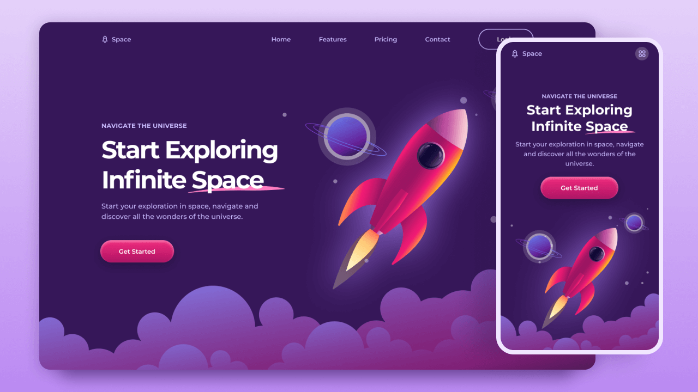

🚀 Space Landing Page
A fully responsive, creative, and interactive space-themed landing page built with HTML, CSS, JavaScript, and GSAP. This project simulates a rocket launch and lets users explore space elements with smooth animations and parallax effects across all devices.

🌌 Features
🚀 Rocket launch animation using GSAP

🌠 Animated starfield background

🪐 Interactive planets and scroll-based effects

📱 Responsive design for mobile, tablet, and desktop

✨ Smooth transitions and modern UI

🛠️ Technologies Used
HTML5

CSS3 (Flexbox & Media Queries for responsiveness)

JavaScript (Vanilla)

GSAP (GreenSock Animation Platform)

📸 Preview

